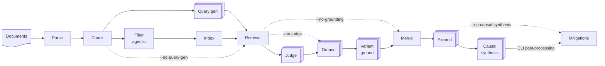

# Asago Policy Mapper

Unstructured policy-to-risk mapping via [AI Risk Atlas Nexus](https://github.com/IBM/ai-atlas-nexus).

## Introduction

Corporate AI policies exist as unstructured documents — PDFs, Word files, HTML pages — written in natural language. Safety tools, evaluation frameworks, and governance processes all deal with risks, but there is no automated way to bridge from raw policy text to those risks.

This semantic gap — from *"the model must not provide medical advice"* to `atlas-hallucination`, `nist-ms-2.5`, `owasp-llm09-2025` — is the critical transformation that enables all downstream automation.

This software takes raw, unstructured policy documents and produces a **risk landscape**: a set of AI Risk Atlas Nexus risk identifiers with enrichments.

- **Risk identification** — Identifies Nexus risk IDs (e.g., `atlas-hallucination`, `air-2024-0042`, `nist-ms-2.5`) directly from policy text
- **Cross-taxonomy mapping** — A static SSSOM mapping (`src/asago_policy_mapper/data/risk_to_category.sssom.tsv`) maps extracted risks to category-level taxonomies (NIST AI RMF, OWASP Top 10 LLM, OWASP ASI, AILuminate)
- **Evidence grounding** — Each identified risk is grounded to specific passages in the source document, providing traceability from risk to policy text
- **Confidence scoring** — Each risk mapping includes a confidence score, enabling human review of uncertain mappings

### Example

```yaml
# Input: "acme-ai-policy.pdf"
#   contains: "The AI system must not generate content that could
#              be construed as medical advice..."

# Output:
risk_extraction:
  risks:
    - nexus_id: atlas-hallucination
      confidence: 0.92
      evidence:
        - exact: "The AI system must not generate content that could be construed as medical advice"
          document: "acme-ai-policy.pdf"
          page: 12
      cross_mappings:
        - nist-ms-2.5 (Confabulation)
        - owasp-llm09-2025 (Misinformation)
        - air-2024-0156 (Health misinformation)
```

## Pipeline

The service parses and chunks input documents, then uses hybrid retrieval (keyword and semantic search) against the Nexus risk catalogue to identify candidate risks directly from the policy text. By default, an LLM generates search queries from chunk groups in risk-taxonomy vocabulary (disable with `--no-query-gen` to use raw chunk text). An LLM then grounds accepted candidates with evidence spans.



1. **Parse** — Docling converts PDF/DOCX/HTML to markdown
2. **Chunk** — Split into ~512-token chunks with page/section metadata
3. **Filter agentic risks** — If the document does not contain agent-related terminology, agentic risks are removed from the catalogue before indexing
4. **Index** — Build BM25 + bi-encoder + cross-encoder index over Nexus risks. Variant risks (IDs containing `---`) are collapsed into synthetic parent entries for indexing.
5. **Query gen** *(optional, on by default)* — LLM generates 1-3 search queries per section group in risk-taxonomy vocabulary (parallel; disable with `--no-query-gen`)
6. **Retrieve** — Hybrid search using generated queries (or, with `--no-query-gen`, per-chunk BM25 + semantic search with RRF fusion and cross-encoder reranking)
7. **Judge** — LLM judges borderline candidates (parallel; only applies to fallback chunks in query-gen mode, since query-gen chunks bypass borderline classification)
8. **Ground** — LLM extracts evidence passages and confidence (parallel, multi-pass)
9. **Variant ground** — For collapsed parent risks that survived grounding, a specialized LLM call selects only the specifically evidenced variant sub-types
10. **Merge** — Deduplicate across chunks, keep top-3 evidence spans
11. **Expand** — Sibling expansion: found risks are expanded to parent siblings + cross-taxonomy mappings, then grounded against relevant document chunks (parallel)
12. **Causal synthesis** — LLM synthesizes threat-source → threat → vulnerability → consequence → impact chains per matched risk (parallel; disable with `--no-causal-synthesis`)
13. **Mitigations** — CLI post-processing: enriches results with mitigation actions and risk cross-maps from Nexus (not part of the extraction pipeline)

### Two-Tier Evaluation

The pipeline extracts **risk-level** risks (IBM Risk Atlas, Credo UCF, AIR 2024, MIT AI Risk Repository — ~486 specific risks). Evaluation runs at two tiers:

- **Tier 1 (risk-level)**: precision/recall/F1 on exact risk ID matches against ground truth
- **Tier 2 (category-level)**: risk IDs are mapped to category-level taxonomies (NIST AI RMF, OWASP Top 10 LLM, OWASP ASI) via a static SSSOM cross-taxonomy mapping (`src/asago_policy_mapper/data/risk_to_category.sssom.tsv`), then precision/recall/F1 is computed per category taxonomy

Category-level eval answers "did we find the right risk themes?" — more forgiving than risk-level since finding *any* bias-related risk satisfies the NIST `harmful-bias-or-homogenization` category.

### Cross-Taxonomy Mapping

`src/asago_policy_mapper/data/risk_to_category.sssom.tsv` is a static SSSOM file mapping 486 risk-level risks to 4 category-level taxonomies (NIST AI RMF 12 risks, OWASP LLM 10 risks, AILuminate 12 risks, OWASP ASI 10 risks). Built from Nexus mapping files + manually reviewed gap-fill for IBM agentic risks, Credo, MIT, and AIR 2024 (314 risks via group-level inheritance). Contains 802 entries; only strong predicates (exact/close/broadMatch) are used at eval time — relatedMatch is excluded.

### Mitigation Index

`src/asago_policy_mapper/data/atlas_risk_to_actions.yaml` maps 80 Atlas risk IDs to ~552 recommended mitigation actions across 3 frameworks:

- **OWASP LLM Top 10 v2.0** (114 action-risk links) — `src/asago_policy_mapper/data/owasp_llm_2.0_actions_data.yaml`
- **NIST AI RMF 600-1** (338 action-risk links) — `src/asago_policy_mapper/data/nist_ai_rmf_actions_to_atlas_data.yaml`
- **AIUC-1** (100 action-risk links) — `src/asago_policy_mapper/data/aiuc1_actions_to_atlas_data.yaml`

All mappings are direct `hasRelatedRisk: atlas-*` — no transitive cross-framework hops. Each action is categorized as `technical`, `operational`, or `governance` via rules in `src/asago_policy_mapper/data/mitigation_categories.yaml`. Regenerate after data file changes: `python scripts/build_mitigation_index.py`

### Prompt Templates

LLM prompts are Jinja2 templates in `src/asago_policy_mapper/templates/prompts/` (rendered by `prompts.py::render_prompt()`). Each prompt requires a `*_user.j2` template and may optionally define a `*_system.j2` template; current prompt names with user templates are `judge_risk`, `judge_risk_gepa_demos`, `generate_queries`, `ground_evidence`, `ground_variants`, `ground_group`, and `causal_synthesis`.

## LLM Integration

All LLM calls go through `llm.py`, which wraps the OpenAI client with [instructor](https://github.com/instructor-ai/instructor) for structured Pydantic outputs. `TokenTracker` accumulates token usage across pipeline stages; `LLMConfig` holds connection details.

- Automatic retry on validation errors (appends error hint), context overflow detection (reduces `max_tokens`), and prompt truncation on incomplete output
- Sampling parameters (`temperature`, `top_p`, `top_k`) are injected by the tracking wrapper from `LLMConfig` defaults — call sites don't set them directly. `top_k` is passed via `extra_body` for vLLM compatibility.
- All LLM calls default to `temperature=0.0`; override with `--temperature`, `--top-p`, `--top-k` CLI flags (e.g. `--temperature 1.0 --top-p 0.95 --top-k 64` for Gemma 4)

## Recommended Models

The pipeline uses three models: a **bi-encoder** for initial semantic retrieval, a **cross-encoder** for reranking, and an **LLM** for judging and grounding. The defaults run locally without GPU, but quality improves significantly with better models served remotely via vLLM.

### Quick Reference

| Tier | Bi-encoder | Cross-encoder | How to run | IR F1 |
|------|-----------|--------------|------------|-------|
| **Best quality** | Qwen3-Embedding-4B | GTE-reranker-modernbert-base | GPU cluster via vLLM | 0.465 |
| **Good quality** | google/EmbeddingGemma-300M | GTE-reranker-modernbert-base | GPU cluster via vLLM | 0.443 |
| **Local (no GPU)** | all-mpnet-base-v2 | ms-marco-MiniLM-L-12-v2 | CPU, runs anywhere | 0.351 |

F1 scores are from IR-only evaluation (no LLM judge/grounding) on 27 policies. With LLM stages enabled, the local default achieves F1=0.719 end-to-end; with sibling expansion (`--expand-siblings`), Qwen3+GTE achieves F1=0.753.

### Bi-encoders

**Qwen3-Embedding-4B** (recommended) — instruction-aware, 2560-dim, 8K context. Best first-stage retrieval: higher precision than other bi-encoders at comparable recall. Requires a query instruction and remote serving via vLLM.

**google/EmbeddingGemma-300M** — 300M params, good quality without instructions. Slightly better recall than mpnet (0.895 vs 0.871).

**all-mpnet-base-v2** (default) — 110M params, runs locally on CPU. Good baseline but instruction-unaware.

### Cross-encoders

**Alibaba-NLP/gte-reranker-modernbert-base** (recommended) — AUC=0.759 on pipeline-mined negatives. Genuinely discriminates relevant from irrelevant candidates. Outputs calibrated scores (no sigmoid needed). Serve via vLLM's `/v1/score` endpoint.

**cross-encoder/ms-marco-MiniLM-L-12-v2** (default) — AUC=0.498 on pipeline-mined negatives (essentially random). Functions as a volume reduction filter rather than a semantic discriminator. Runs locally. Works well enough end-to-end because the LLM grounding stage provides the actual precision filtering.

### ColBERT

ColBERT late-interaction models are supported via `--colbert-model` (replaces bi-encoder + cross-encoder with a single model using MaxSim scoring). ColBERT models are local-only — vLLM returns pooled embeddings, not token-level.

### Configuration Examples

Pass a **model name** to run locally (downloaded on first use), or a **URL** to use a remote model served via vLLM.

**Best quality** (Qwen3 + GTE, both on GPU cluster):

```bash
uv run asago-policy-mapper extract policy.pdf -o output/ \
  --nexus-base-dir /path/to/ai-atlas-nexus \
  --base-url http://localhost:8000/v1 --model my-model \
  --bi-encoder-model https://qwen3-embedding-serving.example.com/v1/embeddings \
  --cross-encoder-model https://gte-reranker-serving.example.com/v1/score \
  --query-instruction "Instruct: Given a text passage from an AI governance policy document, retrieve AI risk descriptions that are relevant to the concepts, requirements, or concerns discussed in the passage\nQuery: " \
  --expand-siblings
```

**Good quality** (EmbeddingGemma + GTE, remote):

```bash
uv run asago-policy-mapper extract policy.pdf -o output/ \
  --nexus-base-dir /path/to/ai-atlas-nexus \
  --base-url http://localhost:8000/v1 --model my-model \
  --bi-encoder-model https://embeddinggemma-serving.example.com/v1/embeddings \
  --cross-encoder-model https://gte-reranker-serving.example.com/v1/score
```

**Local with GTE reranker** (bi-encoder local, cross-encoder local — needs GPU for GTE):

```bash
uv run asago-policy-mapper extract policy.pdf -o output/ \
  --nexus-base-dir /path/to/ai-atlas-nexus \
  --base-url http://localhost:8000/v1 --model my-model \
  --cross-encoder-model Alibaba-NLP/gte-reranker-modernbert-base
```

**Local defaults** (no GPU needed, models downloaded automatically):

```bash
uv run asago-policy-mapper extract policy.pdf -o output/ \
  --nexus-base-dir /path/to/ai-atlas-nexus \
  --base-url http://localhost:8000/v1 --model my-model
```

**IR-only** (no LLM needed — useful for quick evaluation):

```bash
uv run asago-policy-mapper extract policy.pdf -o output/ \
  --nexus-base-dir /path/to/ai-atlas-nexus \
  --no-judge --no-grounding
```

## Setup

Requires Python 3.11+ and [uv](https://docs.astral.sh/uv/).

```bash
uv sync
```

You need a local clone of [ai-atlas-nexus](https://github.com/IBM/ai-atlas-nexus) — set its path via `NEXUS_BASE_DIR` env var or `--nexus-base-dir` flag.

## Usage

### Extract risks from a policy document

```bash
uv run asago-policy-mapper extract policy.pdf -o output/ \
  --base-url http://localhost:8000/v1 \
  --model my-model \
  --nexus-base-dir /path/to/ai-atlas-nexus
```

Outputs `risk-extraction.json` and `risk-extraction.html` report. Use `--output-format yaml` to get `risk-extraction.yaml` instead, or `--output-format both` for both.

### Evaluate against ground truth

```bash
uv run asago-policy-mapper eval output/ -g evals/ground_truth/policy-name.yaml
```

### Run a battery of extractions

```bash
just run-risk-extract-battery batteries/risk-selected.yaml <base-url> <model>
```

Runs extraction + eval across all policies in the battery config, generates per-run reports and a summary with per-taxonomy heatmaps.

### Advanced Usage

```bash
# Battery with more options (direct invocation)
python run_extract_battery.py batteries/risk-selected.yaml --base-url <url> --model <model> -j 6

# Battery with MLflow tracking disabled
just no_mlflow="1" run-risk-extract-battery batteries/risk-selected.yaml <base-url> <model>

# Battery with custom MLflow experiment name
python run_extract_battery.py batteries/risk-selected.yaml --base-url <url> --model <model> --mlflow-experiment my-experiment

# IR-only mode (no LLM judge/grounding, no --base-url/--model needed)
uv run asago-policy-mapper extract policy.pdf -o output/ \
  --nexus-base-dir /path/to/ai-atlas-nexus --no-judge --no-grounding
just no_judge="1" no_grounding="1" run-risk-extract-battery batteries/risk-selected.yaml

# Judge only, no grounding (test judge contribution in isolation)
uv run asago-policy-mapper extract policy.pdf -o output/ \
  --nexus-base-dir /path/to/ai-atlas-nexus --no-grounding \
  --base-url <url> --model <model>

# Skip causal synthesis (use static YAML chains)
uv run asago-policy-mapper extract policy.pdf -o output/ \
  --nexus-base-dir /path/to/ai-atlas-nexus --no-causal-synthesis \
  --base-url <url> --model <model>

# Smaller chunks with larger judge context window
uv run asago-policy-mapper extract policy.pdf -o output/ \
  --nexus-base-dir /path/to/ai-atlas-nexus \
  --chunk-max-tokens 256 --judge-context-tokens 512 \
  --base-url <url> --model <model>

# Disable LLM query generation (use raw chunk text for retrieval)
uv run asago-policy-mapper extract policy.pdf -o output/ \
  --nexus-base-dir /path/to/ai-atlas-nexus --no-query-gen \
  --base-url <url> --model <model>

# Rebuild mitigation index (after data file changes)
python scripts/build_mitigation_index.py
```

## Tests

```bash
uv run pytest
```

## License

Apache License 2.0
